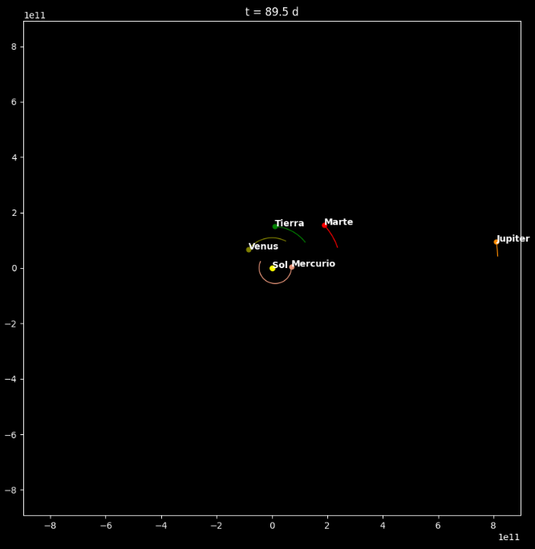

# Solar System Simulator

Simulates the motion of the solar system's planets through the use of an Euler integrator, using each planets' aphelion position and orbital velocity as initial parameters.

## Dependencies

* `matplotlib`
* `python >= 3.12`